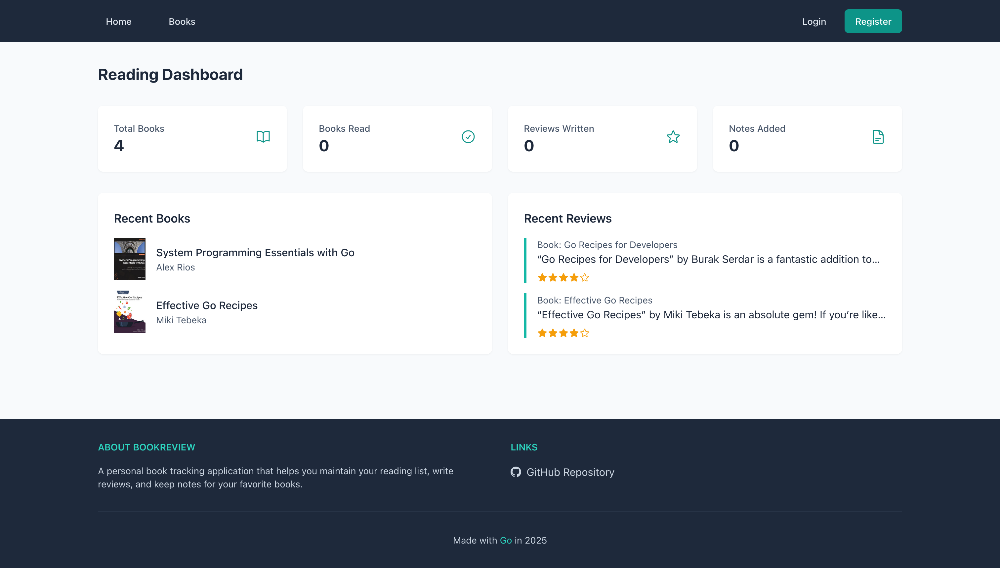

# Personal BookReview
 


A web application built with Go that helps you manage your personal book collection, track reading progress, write reviews, and take notes. Perfect for book enthusiasts who want to maintain a digital library of their reading journey.

A demo can be seen here: [demo](https://books.coderustle.dev)

## Screenshots

### Home Page


## Features

- **User Authentication**
    - Secure registration and login
    - Session management
    - CSRF protection
    - Password encryption

- **Book Management**
    - Add books with cover images
    - Track reading status (want to read, reading, finished)
    - Search functionality
    - List books with pagination

- **Reviews & Notes**
    - Write and edit book reviews
    - Star ratings system
    - Page-specific notes
    - Chronological tracking

- **Rich UI Experience**
    - Responsive design
    - Real-time updates with HTMX
    - Modern interface with Tailwind CSS
    - Interactive components

## Dependencies

### Backend Dependencies
- `go-sqlite3` v1.14.24 - SQLite database driver
- `scs/v2` v2.8.0 - Session management
- `nosurf` v1.1.1 - CSRF protection
- `goose/v3` v3.24.1 - Database migrations
- `form/v4` v4.2.1 - Form handling
- `golang.org/x/crypto` - Password hashing

### Frontend Dependencies
- Tailwind CSS v3.4.17
- HTMX for dynamic interactions
- Iconify for icons
- SweetAlert2 for notifications

### Development Tools
- **Air**: Live reload for Go applications during development
- **Browser-sync**: Browser synchronization and auto-reload
- **Just**: Command runner for development tasks
- **Goose**: Database migration tool

## Tech Stack

### Backend
- **Go** - Main programming language
- **SQLite** - Database
- **Goose** - Database migrations

### Frontend
- **Tailwind CSS** - Styling
- **HTMX** - Dynamic interactions

## Getting Started

### Prerequisites

Before you begin, ensure you have the following installed:
- Go 1.23 or later
- SQLite
- Docker (optional, for containerized deployment)
- Git

### Running with Docker

1. Clone the repository:
```bash
git clone https://github.com/madalinpopa/go-bookreview.git
cd go-bookreview
```
2. Build Docker image:
```bash
docker build . -t coderustle/bookreview:latest --platform linux/amd64
```
3. Run Docker container:
```bash
docker run -d --rm --name bookreview \
           -v bookreview_data:/app/data \
           -v bookreview_uploads:/app/uploads \
           -p 4000:4000 \
           coderustle/bookreview:latest
```

The application will be available at `http://localhost:4000`

### Development Setup

1. Install dependencies:
  - Go 1.x or higher
  - TailwindCSS CLI
  - Just command runner
  - Air (for live reloading)
  - Browser-sync
  - Goose (for database migrations)

2. Install project dependencies:
   ```bash
   go mod download
   ```

3. Run database migrations:
   ```bash
   just migrate up
   ```

4. Start the development server:
   ```bash
   just dev
   ```

This will start:
- The Go server with live reloading
- TailwindCSS compiler in watch mode
- Browser-sync for automatic browser refreshing

## Development Commands

- Update Go dependencies: `just update`
- Build production CSS: `just build`
- Run migrations: `just migrate [command]`
- Create new migration: `just makemigrations [name]`
- Seed database with admin user: `just seed`

### Project Structure

```bash
go-bookreview/
├── cmd/
│   └── web/             # Application entrypoint
├── internal/
│   ├── app/             # Application core
│   ├── forms/           # Form handling
│   ├── middleware/      # HTTP middleware
│   ├── models/          # Data models
│   ├── routes/          # URL routing
│   └── views/           # View handlers
├── migrations/          # Database migrations
├── ui/
│   ├── html/            # HTML templates
│   ├── static/          # Static assets
│   └── assets/          # Source assets
└── uploads/             # User uploads
```
## Contributing

1. Fork the repository
2. Create your feature branch: `git checkout -b feature/my-new-feature`
3. Commit your changes: `git commit -am 'Add some feature'`
4. Push to the branch: `git push origin feature/my-new-feature`
5. Submit a pull request

## License

This project is licensed under the MIT License - see the LICENSE file for details.